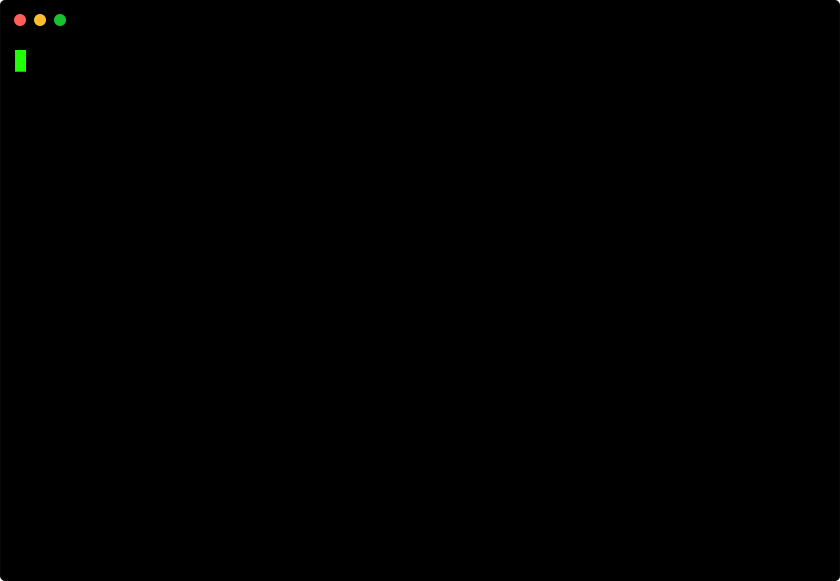

# dorky
```
     __            __          
 .--|  .-----.----|  |--.--.--.
 |  _  |  _  |   _|    <|  |  |
 |_____|_____|__| |__|__|___  |
                        |_____|
```

`DevOps Records Keeper`

[](https://npmjs.com/package/dorky)

 `&& ` 

Let us assume that we need to create a project.

The project obviously contains some code and some secret variables like database information, API keys, etc. This data cannot be shared on public VCS (GitHub), but at times is required to be accessible remotely to be shared among reliable sources.

Anyhow, we shall store it on a private storage, using **dorky**, that stores it on a S3.

## Steps to use:

> Create a S3 bucket, AWS_ACCESS_KEY and AWS_SECRET_KEY.



> Please use your own repository, this repository `sample_project` is just for demonstration.

### To push files to S3 bucket.
1. Initialize dorky setup in the root folder of your project, using `dorky init`.
2. List the files using `dorky list`, (make sure to add excluded file or folder patterns to .dorkyignore, to minimize the list).
3. Add files to stage-1 using `dorky add file-name`.
4. Push files to S3 bucket using `dorky push`.

### To remove a file from project.
1. Remove files using `dorky reset file-name`.
2. Push files to S3 bucket using `dorky push`.

### To pull files from S3 bucket.
1. Initialize dorky project using `dorky init`.
2. Use `dorky pull` to pull the files from S3 bucket.